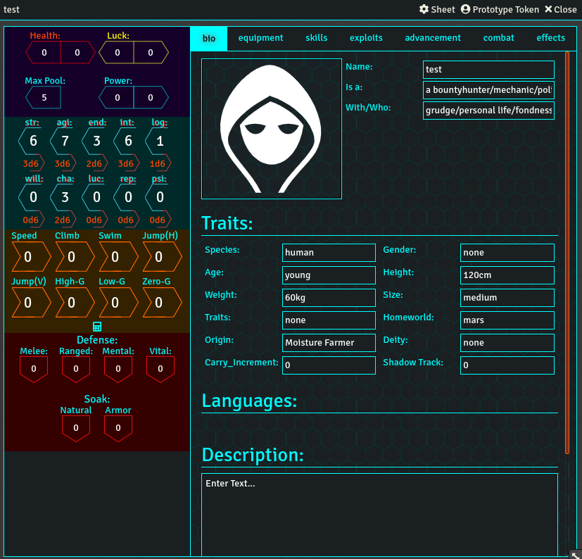
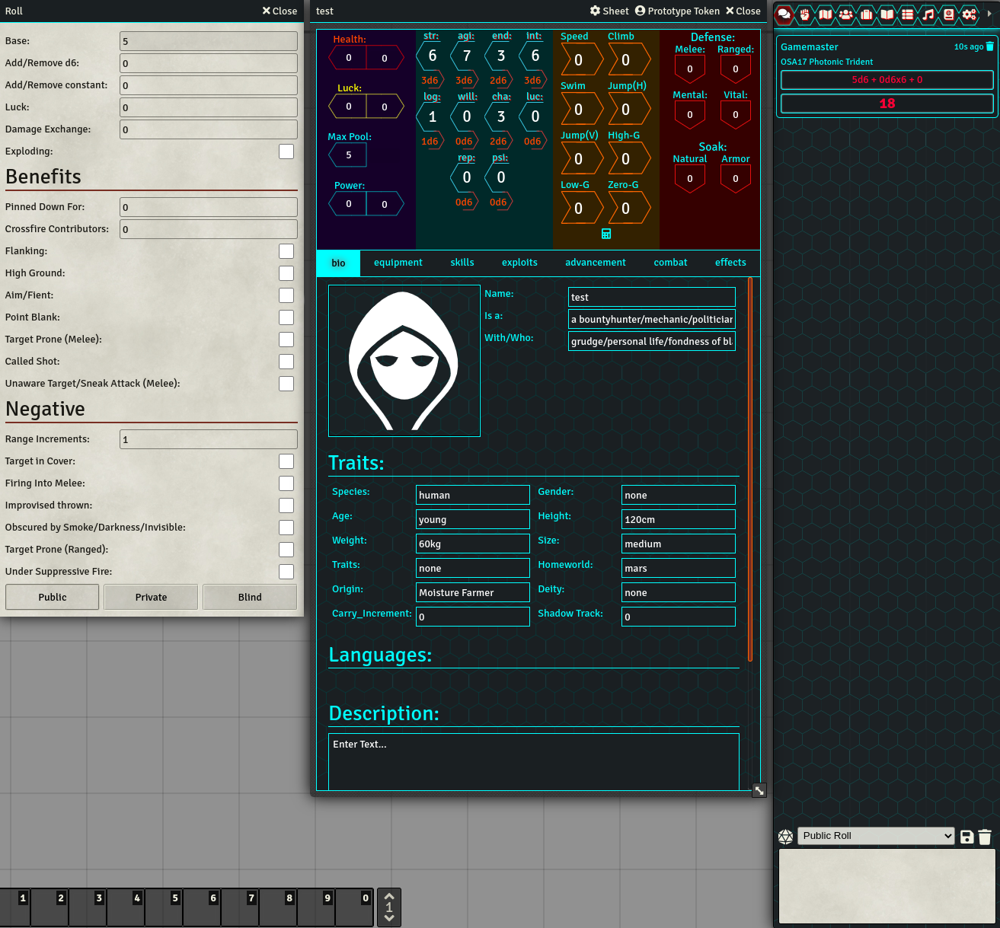

# Maintenance Note
This is a fork updating the system to Foundry v11, it just do the basics: updating system.json, removing .db files and adding new packs.

# WOINFoundry
WOINFoundry adds support for WOIN to Foundry. I made this system for my groups NEW game (so the theming and compendiums support NEW), but this should be able to support OLD, NOW, etc just without compendiums.

Contributions for other compendiums would be appreciated.

Currently the system runs stable on foundry v9, though given the upgrade was recent there may be some bugs (please report them if you run into any).

# Images

# Old Repo:
WOINFoundry used to be found at https://gitlab.com/mcarthur.alford/woinfoundry prior to migrating to github. Older versions can be found there.

# What is WOIN?
The WOIN rules and information can be found at http://www.woinrpg.com/.
All content used in the system is under the open games license version 1.0a, found at http://www.woinrpg.com/open-gaming-license.
